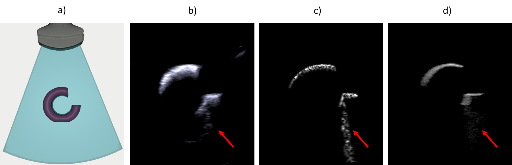
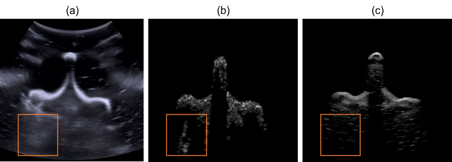

# UltraRay: Introducing Full-Path Ray Tracing in Physics-Based Ultrasound Simulation

### [Pre-Print](https://arxiv.org/abs/2501.05828)

[Felix Duelmer](https://www.cs.cit.tum.de/camp/members/felix-duelmer/),
[Mohammad Farid Azampour](https://www.cs.cit.tum.de/camp/members/mohammad-farid-azampour/),
[Magdalena Wysocki](https://www.cs.cit.tum.de/camp/members/magdalena-wysocki/),
[Nassir Navab](https://www.cs.cit.tum.de/camp/members/cv-nassir-navab/nassir-navab/),

Technical University of Munich

Welcome to the official repository for the paper: "UltraRay: Introducing Full-Path Ray Tracing in Physics-Based Ultrasound Simulation", a novel approach to simulating ultrasound images using full-path ray tracing.

## Pipeline Overview


UltraRay implements a complete ultrasound simulation pipeline that models the full acoustic path from transducer emission to signal reception. The system consists of three main stages:

1. **Scene Setup**: 3D Scene definition, including transducer setup and tissue property definition + localization. 
2. **Ray Tracing & RF Data Generation**: Raw radiofrequency (RF) data generation from traced acoustic paths with proper time-of-flight and attenuation modeling.
3. **Beamforming & B-Mode Reconstruction**: Signal processing to reconstruct B-mode ultrasound images from RF data





*Comparison results showing UltraRay's simulation capabilities on cylindrical and vertebrae phantom data*

For detailed technical information about the ray tracing approach and system architecture, see the [system overview document](assets/ultra_ray_general_setup%20(2).pdf).

## Code Structure

- **`src/`**: Main simulation entry point and scene configuration files for running ultrasound simulations
- **`ultra_ray/`**: Core UltraRay library containing all simulation components and algorithms
- **`ultra_ray/integrators/`**: Ray tracing integrators that handle acoustic wave propagation and scattering
- **`ultra_ray/sensors/`**: Convex transducer sensor implementations for ultrasound probe modeling
- **`ultra_ray/beamformers/`**: Signal processing modules for RF data beamforming and B-mode reconstruction
- **`ultra_ray/films/`**: Specialized film classes for capturing RF data from ray tracing
- **`ultra_ray/render/`**: Rendering utilities and echo processing blocks
- **`ultra_ray/utils/`**: Utility functions including transducer mesh generation
- **`scenes/`**: 3D scene data and objects for simulation (download required - see Data Download section)
- **`external/`**: Modified Mitsuba 3 renderer with ultrasound-specific extensions
- **`results/`**: Generated simulation outputs and beamformed images
- **`assets/`**: Documentation figures and pipeline diagrams

## Getting Started

### Prerequisites

- Recent versions of CMake (at least 3.9.0)
- Python (at least 3.8)
- Git
- CUDA-capable GPU with up-to-date drivers (minimum driver version v535)
- On Linux: Clang compiler (recommended over GCC)

### Step 1: Clone the Repository

Clone this repository with all submodules:

```sh
git clone --recursive https://github.com/Felixduelmer/UltraRay.git
cd UltraRay
```

If you already cloned without `--recursive`, initialize the submodules:

```sh
git submodule update --init --recursive
```


### Step 2: Create Python Virtual Environment

Create and activate a virtual environment to isolate UltraRay dependencies:

```sh
# Create virtual environment
python -m venv ultraray_env

# Activate virtual environment
source ultraray_env/bin/activate
```

### Step 3: Build Mitsuba 3 (Further information can be found [here](https://mitsuba.readthedocs.io/en/v3.5.2/src/developer_guide/compiling.html))

UltraRay is based on [Mitsuba 3](https://mitsuba.readthedocs.io/en/latest/) and uses a custom fork with ultrasound-specific modifications. The [`cuda_mono`](https://mitsuba.readthedocs.io/en/latest/src/key_topics/variants.html#sec-variants) variant is recommended to run UltraRay. If no GPU is available you can switch to [`llvm_mono`](https://mitsuba.readthedocs.io/n/latest/src/key_topics/variants.html#sec-variants) to run the ray tracing in parallel on the available CPU cores. 

It is important to build Mitsuba with the same python version that is later going to be used for running the code.

#### Linux Build Instructions

```sh
# Navigate to the Mitsuba submodule
cd external/mitsuba

# Install dependencies (Ubuntu/Debian)
sudo apt install clang-10 libc++-10-dev libc++abi-10-dev cmake ninja-build libpng-dev libjpeg-dev libpython3-dev python3-distutils

# Set compiler environment variables
export CC=clang-10
export CXX=clang++-10

# Create build directory
mkdir build
cd build

# Configure with CMake
cmake -GNinja ..
```

#### Windows Build Instructions (Not Tested)

```sh
# Navigate to the Mitsuba submodule
cd external/mitsuba

# Configure with Visual Studio
cmake -G "Visual Studio 17 2022" -A x64 -B build
```

#### macOS Build Instructions (Not Tested)

```sh
# Install Xcode command line tools
xcode-select --install

# Navigate to the Mitsuba submodule
cd external/mitsuba

# Create build directory
mkdir build
cd build

# Configure with CMake
cmake -GNinja ..
```

### Step 4: Configure Mitsuba Variants

**IMPORTANT**: Before building, you must configure the required variant:

1. Open the generated `mitsuba.conf` file in the build directory
2. Find the `"enabled"` section (around line 86)
3. Add `"cuda_mono"` or `"llvm_mono"` to the list of enabled variants (depending on GPU availability):

```json
"enabled": [
    "scalar_rgb", 
    "scalar_spectral", 
    "cuda_mono",
    "llvm_mono",
    "cuda_ad_rgb", 
    "llvm_ad_rgb"
],
```

### Step 5: Build Mitsuba

```sh
# From the mitsuba/build directory
ninja
```

On Windows with Visual Studio:
```sh
cmake --build build --config Release
```

### Step 6: Configure Environment

After compilation, configure the environment variables:

```sh
# From the mitsuba/build directory
source setpath.sh
```

**Note**: Keep this virtual environment activated for all subsequent steps and when running UltraRay simulations.

### Step 7: Install UltraRay Dependencies

Return to the main project directory and install the package. Choose the appropriate installation option based on your system:

```sh
# Navigate back to the main project root
cd ../../../
```

#### For CPU-only systems (no CUDA GPU):
```sh
# Install UltraRay with core dependencies only
pip install -e .
```

#### For systems with CUDA 12.x GPU:
```sh
# Install UltraRay with CUDA 12.x support
pip install -e ".[cuda]"
```

#### For systems with CUDA 11.x GPU:
```sh
# Install UltraRay with CUDA 11.x support
pip install -e ".[cuda11]"
```

#### For development (with optional CUDA support):
```sh
# Development tools + CUDA 12.x
pip install -e ".[dev,cuda]"

# Development tools + CUDA 11.x
pip install -e ".[dev,cuda11]"

# Development tools only (CPU-only)
pip install -e ".[dev]"
```

### Step 8: Verify Installation

Test that everything is working:

#### For GPU systems:
```python
import mitsuba as mi
mi.set_variant('cuda_mono')  # Use CUDA variant
import ultra_ray
print("UltraRay setup successful with GPU support!")
```

#### For CPU-only systems:
```python
import mitsuba as mi
mi.set_variant('llvm_mono')  # Use CPU variant
import ultra_ray
print("UltraRay setup successful with CPU support!")
```

## Reproducing Results

### Data Download

Scene data to reproduce the B-Mode simulations from the paper can be downloaded from [here](https://drive.google.com/drive/folders/1b75KJJS7MKIzUqtty9yN_kj8spKhG_bB?usp=sharing).

Download the data and place it in the `scenes/` directory to run the examples.


To reproduce the ultrasound simulation results from the paper, run the following commands:

### Cylinder Phantom Simulation
```sh
python src/main.py --config src/configs/cylinder_convex.txt
```

### Vertebrae Phantom Simulation  
```sh
python src/main.py --config src/configs/vertebrae_convex.txt
```

The simulations will generate:
- Raw RF data from the ray tracing process
- Beamformed B-mode ultrasound images saved to the `results/` directory
- Execution time benchmarks for each simulation stage

## Alternative: Environment Configuration

If you prefer not to run the `setpath` script each time, you can add the Mitsuba Python path directly:

```python
import sys
sys.path.append("external/mitsuba/build/python")
import mitsuba as mi
mi.set_variant('cuda_mono')
```

## Notes

- This project uses a modified version of Mitsuba 3 with ultrasound-specific features
- Make sure your CUDA drivers are up-to-date
- Compilation time scales with the number of enabled variants
- Generated beamformed images are saved to the `results/` directory
- **Performance Note**: Due to Mitsuba's warm-up phase where the symbolic loop is recorded during first execution, the initial simulation run will be slower. Subsequent executions of the same simulation will be significantly faster as the compiled kernels are reused

## Acknowledgments

Parts of the code are from the [mitransient](https://github.com/diegoroyo/mitransient) implementation.